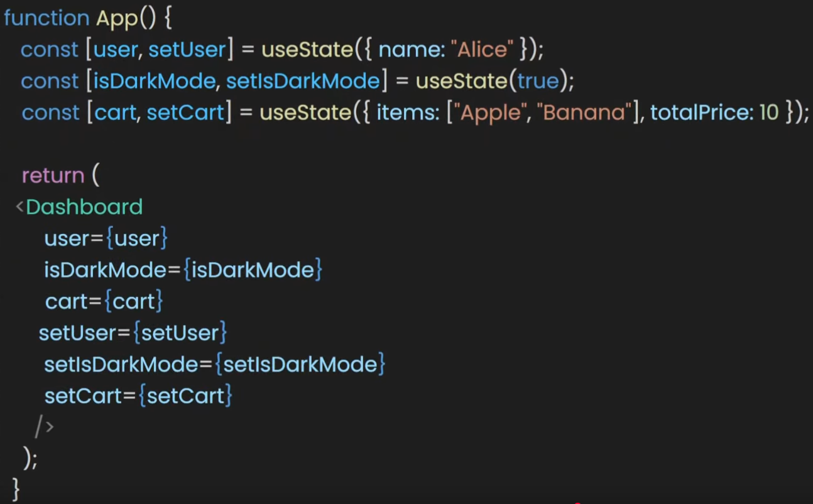
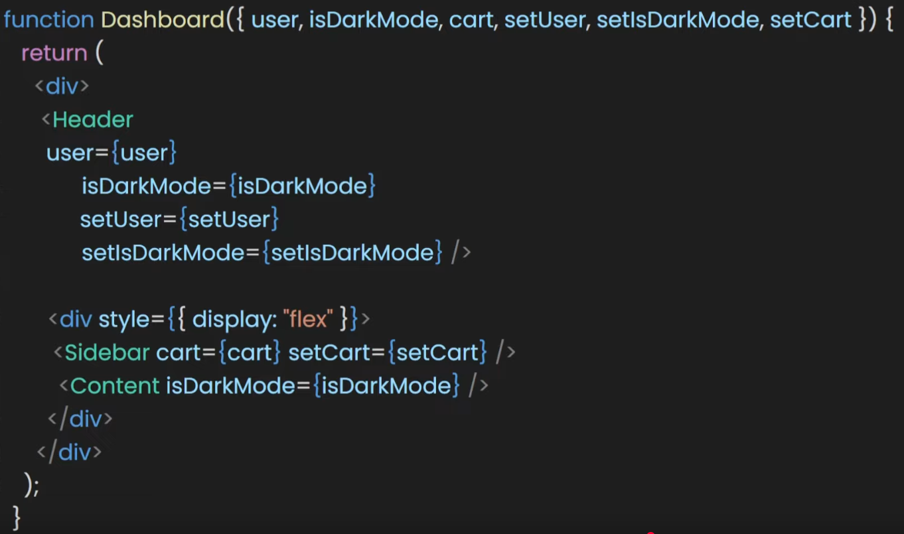
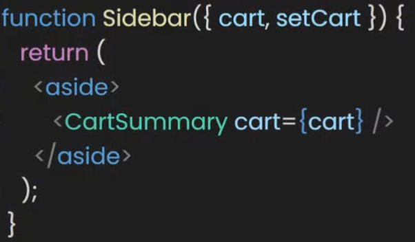
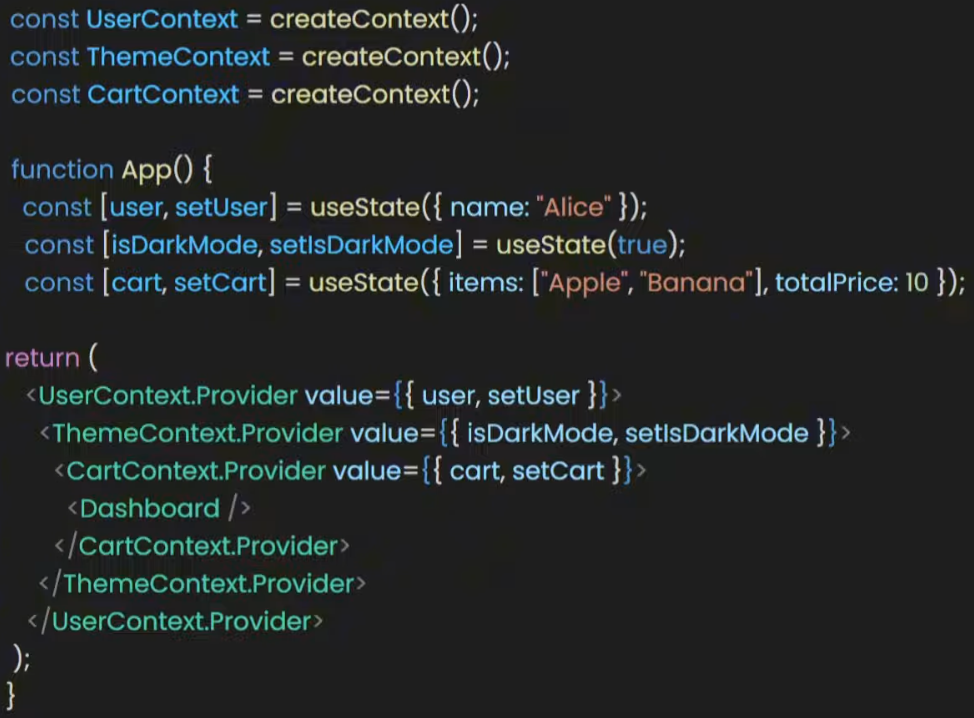
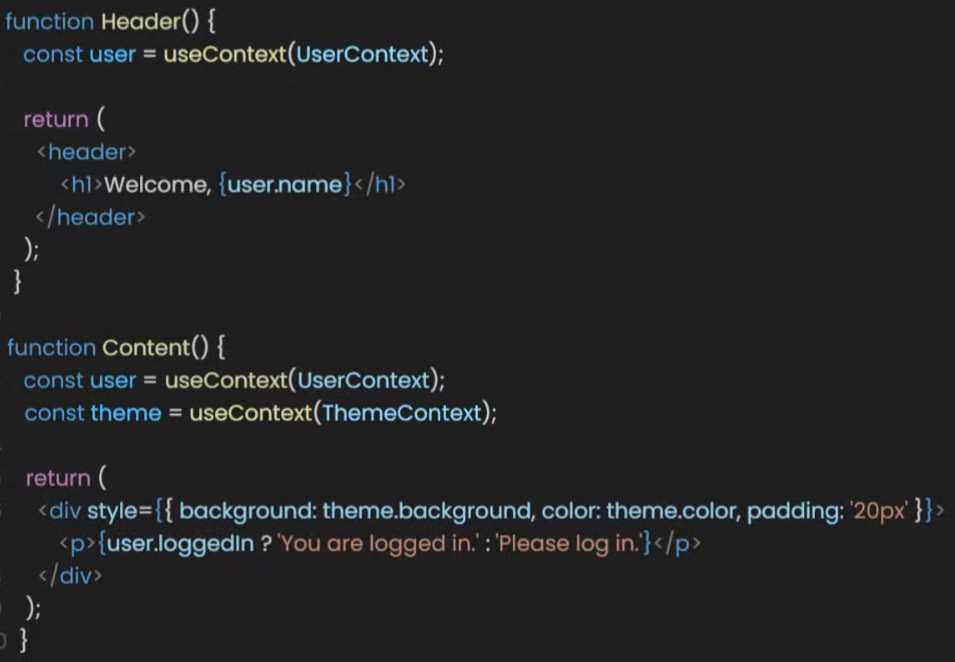

sources: 
- https://www.youtube.com/watch?v=HYKDUF8X3qI  
- https://www.youtube.com/watch?v=n7xQVRpYHYY

TO READ: https://deku.posstree.com/en/react/context-api/  

# What is a Context in React?

Think of it as a way to store **data** and have it be **accessible** to any component.  
**Contexts** let our components access data without having to pass that data through **props**.  

`useContext` lets our components access **shared data** from anywhere in the **component tree**, 
without having to pass that data to mutliple components...  

With `useContext`, our data lives in one place, and any component that needs it can just "grab" it.  
No need to "bother" any other component.  

It's the easy direct way to share a **state** in React.  

In 2018, React added the **Context API** to help with the annoying issue of **prop drilling**.  
In 2019, the `useContext` hook made accessing context values as easy as calling a function inside your component.  

# What is **Prop Drilling**

It's when we are required to pass props through multiple levels of components to let them access data.  
But thanks to the `useContext` hook, we no longer need to do **prop drilling**.  

Eliminating "prop drilling" makes our code more concise and maintainable.  
That's especially true in applications with deeply nested components. 

# How does `useContext` work?

Think of it like a magic **portal** that sends data to any component in your app without needing to pass
it through every layer.  

To create this portal, we use `createContext()` and store it in a variable.  
This portal can hold any data we want to share.  

To open the portal, we need to use the `Context.Provider`.  
Then include all the components that can access the portal, and load the provider with all 
the items we want to send.  
 
  
  
To then use the portal in any component, we use the `useContext` hook, just passing the portal we 
created (with `createContext()`) to `useContext`.  
Then extract the data from the context/portal into a variable:  

  

Of course, we can do the same in the `DiningRoom` component:  

  


# How to create a Context?

We usually create our context files within a `/src/contexts` folder.

Here's an example of a context file, which would be named `DashboardContext.tsx`:
```tsx
import { createContext } from "react";
import type { User } from "../types";

export const DashboardContext = createContext<User | undefined>(undefined);
```

We want to create a context that can be of `User` type or `undefined`.  
But why `undefined`?  

Our context shouldn't hold nothing but a `user`.  
However, since the context gets created outside of any component, we do not have access
to the `user` at this point.  

# How to provide a Context to a component?

Once we've created a context, we need to provide it to a certain set of components.  
For that, we need to use the `Provider` keyword.  

In the targeted component, we need to import and then **provide** the context:
```tsx
import { useState } from "react";
import { DashboardContext } from "../contexts/DashboardContext";
import type { User } from "../types";
import { UserProfile } from "./UserProfile"; // The component that will consume the context

export default function DashboardPage() {
  const [user, setUser] = useState<User>({
    isSubscribed: true,
    name: 'You',
  });

  return (
    <DashboardContext.Provider value={user}>
      <h1>Dashboard</h1>
      {/* UserProfile is a child component that can now access the context */}
      <UserProfile />
    </DashboardContext.Provider>
  )
}
```
As you can see, we also need to specify a `value`.  
The line `<DashboardContext.Provider value={user}>` makes the user object available to any child component that asks for it, like `<UserProfile />`.  

# How to consume a Context?

1. We create a context
2. We provide it to a component via the `.Provider` keyword
3. We are going to **consume** the context via the `useContext()` hook.  

To access the context's value, a child component must use the `useContext` hook.  
Here is the code for the `<UserProfile />` component we used above.  
It **imports** the same context and uses the `useContext` hook to read the `user` data:
```tsx
import { useContext } from "react";
import { DashboardContext } from "./contexts/DashboardContext";

export const UserProfile = () => {
  // Here we "consume" the context value
  const user = useContext(DashboardContext);

  // It's good practice to handle the case where the context might be undefined,
  // as we defined it initially when calling createContext.
  if (!user) {
    return <div>User not found</div>;
  }

  return (
    <section>
      <h2>Welcome, {user.name}!</h2>
      <p>Subscription Active: {user.isSubscribed ? 'Yes' : 'No'}</p>
    </section>
  );
};
```
Now, the `UserProfile` component has access to the `user` state from `DashboardPage` without it 
ever being passed as a **prop**! This is the **power** of the **Context API**.  

# Recap - how the Context API allows us to eliminate prop drilling

## createContext(), name it, and use the .Provider component

- create a context/portal via `createContext`, which acts as a **portal**
- name the portal by placing it in a variable
- use the `Provider` component that comes with the Context to wrap the components that need access
  to the shared value
- place the data inside the `Provider` component via the `value` prop   

  

By doing this, any **component** inside the `Provider` can access the `value`, without needing to pass it 
through **props** at every level.  

## open the portal with useContext() and access the data

And finally, to get that `name` state in any child component that is wrapped inside the `Provider`, 
we just need to use the `useContext` hook.  

This hook allows us to open the portal that we've created.  
We simply pass the name of the portal/context to the hook, and store the result in a variable.  
And then we can use that variable in a component to access the data from that portal.  

  

# e-commerce dashboard example

We can appreciate the benefits of using the `useContext` hook when we need to manage multiple states with `useState`.  

Imagine we have an e-commerce dashboard where we need to pass user information, theme settings, and shopping cart state
through multiple nested components.  

The **component tree** would look something like that:  
- The App component 
  - The Dashboard component
    - Header
    - Content
    - Sidebar
      - CartSummary

## Sharing data through "prop drilling" 

Inside the App component, we would create 3 states: user, isDarkMode, and cart  
Then we render the Dashboard component and pass each state as a prop.  

  

Then, inside the Dashboard component, we also need to pass these states to the Header and Content components.  
And that means we would also need to create multiple props for each component.  

  

And then, inside the Sidebar component, we also need to pass the prop in CartSummary which will display the cart state:

  

That way of doing things is troublesome and complicated to maintain.  
It would be much better if we could just pass the states directly to the components that need them.  
That's what the **Context API** (2018) and the `useContext` hook (2019) do.  

## Sharing data through Context 

- In the App component, we can remove the props from the Dashboard.  
- Then, let's create 3 contexts for each state: UserContext, ThemeContext, and CartContext.  
- next, let's wrap the Dashboard with each context 
- and finally, let's use a Provider to store the state values (so that we can access them later on)

Here's the new code for the App component:  
  

Now that we've set up the contexts, we can easily access the specific state that we need from anywhere.  

Let's take the deepest component in the component tree, which is CartSummary.  
Previously, to get the state for the cart into CartSummary, we had to pass it from App to Dashboard, 
then from Dashboard to Sidebar, and finally, from Sidebar to CartSummary.  

But with CartContext, we can simply access the context using `useContext`, store it in a variable, 
and then use the cart state directly in CartSummary:
  

Of course, the same applies to UserContext and ThemeContext in other components like the Header and Content:
  

# Conclusion

In conclusion, `useContext` makes it easy to share information like user details, themes, or login status 
between different parts of our application.  

And the best part is that it works well with other hooks, like `useReducer`, so we can make a central place
to store all of our states. It's like a more **relaxed** version of **Redux**.  
